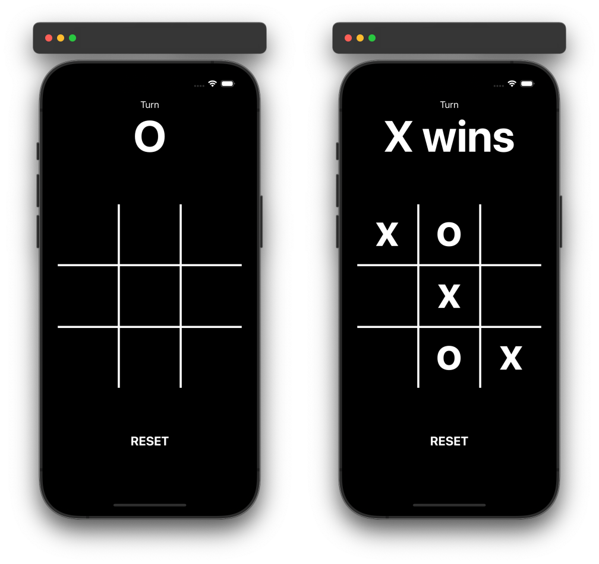

# NoughtCross

## Introduction
This is a simple NoughtCross game implemented in Swift for iOS devices. The game allows two players to play against each other on the same device. The game alternates turns between "X" and "O" and declares a winner or a draw at the end of the game.

### Preview

  

## Features
- Two-player mode on the same device.
- Alternating turns between "X" and "O".
- Displays the current player's turn.
- Declares a winner or a draw at the end of the game.
- Option to reset the board and start a new game.

## Code Structure

### ViewController Class
- **Enum Turn**: Defines the two possible turns, `Nought` and `Cross`.
- **Outlets**: UILabel and UIButton outlets for the game board and the turn indicator.
- **Variables**: 
  - `firstTurn` and `currentTurn` to track whose turn it is.
  - `NOUGHT` and `CROSS` to represent the symbols.
  - `count` to count the number of moves made.
  - `board` to store the buttons on the board.

### Methods
- **viewDidLoad()**: Initializes the board and resets it at the start of the game.
- **boardTapAction(_:)**: Handles the button tap actions on the game board.
- **resetButtonPressed(_:)**: Resets the game when the reset button is pressed.
- **addToBoard(_:)**: Adds the symbol to the board and checks for a win or draw.
- **resetBoard()**: Resets the board and alternates the first turn.
- **victoryCheck(_:)**: Checks if there is a winning combination on the board.
- **strMatch(_:str:)**: Helper function to compare button titles with the given symbol.

## Conclusion
This NoughtCross app is a straightforward implementation of the classic game using Swift and UIKit. It provides a fun and interactive way for two players to enjoy the game on the same device. The code is organized and easy to understand, making it a great project for beginners to learn iOS app development.